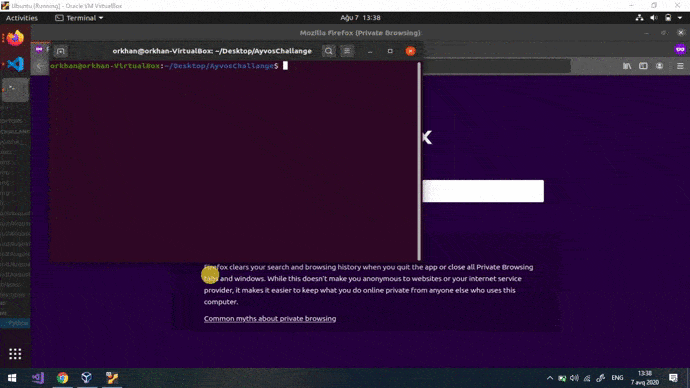
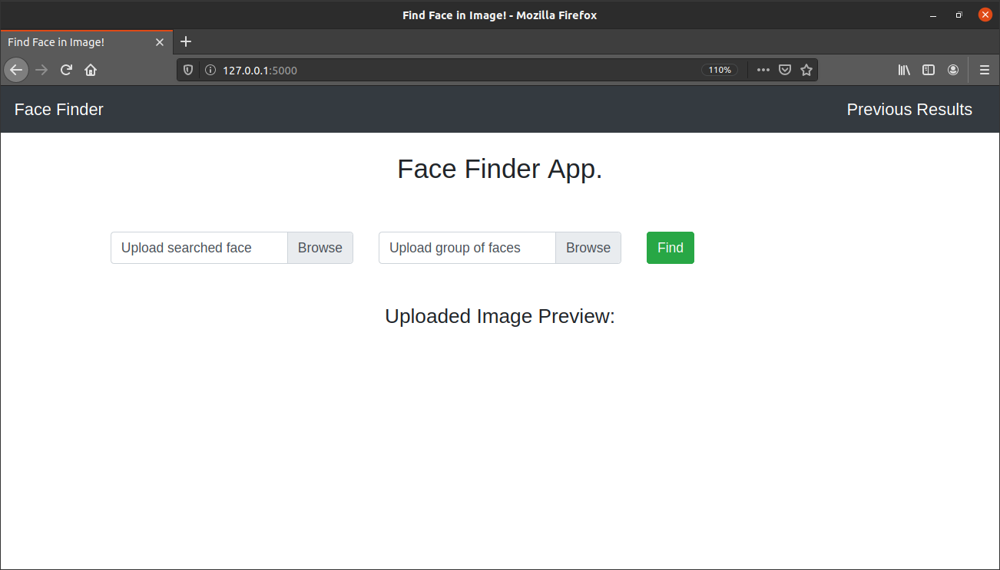
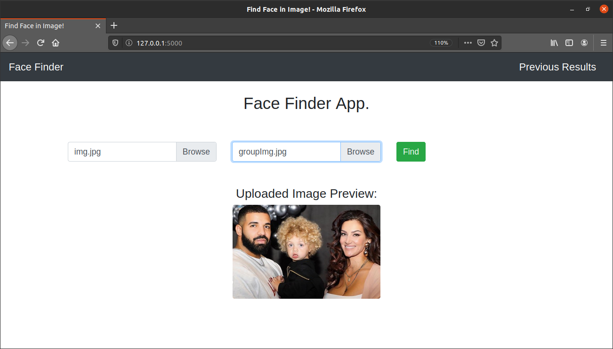
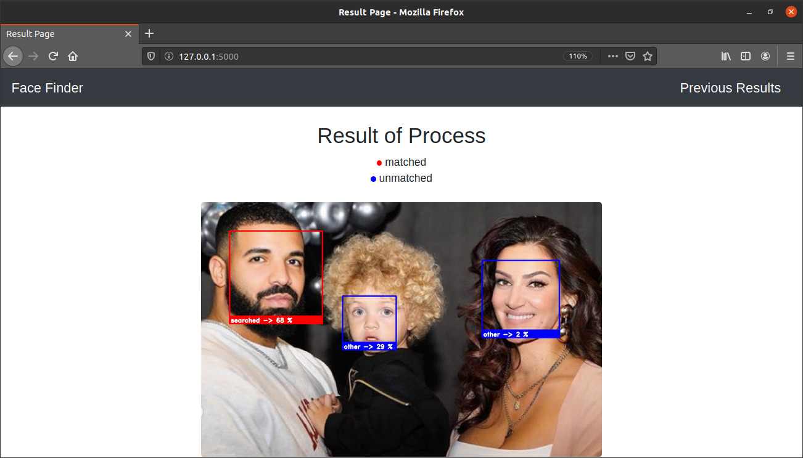
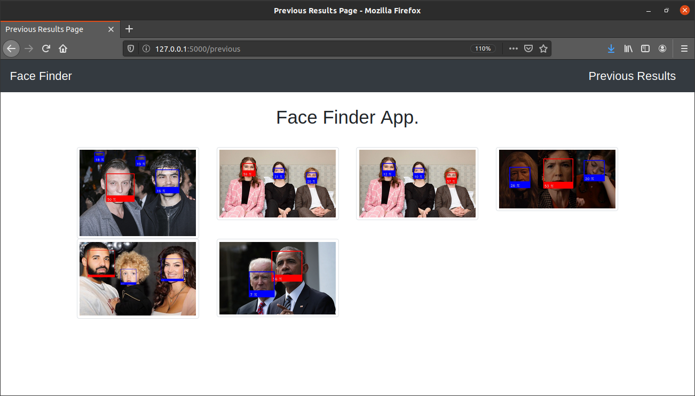

# Face Finder

Web based face finding application.

## Demo



## Required libraries

To use this application you must own or install these following libraries: 

- [face_recognition](https://github.com/ageitgey/face_recognition)

- [Flask](https://pypi.org/project/Flask/)

- [OpenCV](https://pypi.org/project/Flask/)

- [numpy](https://pypi.org/project/numpy/)

- [Pillow](https://pypi.org/project/Pillow/)


## Usage

```bash
flask run
```
Run the app on your machine: **127.0.0.1:5000**

When you visit this address you will see output below:



You can see two upload buttons for upload images. First button is used for upload searched image. Second is for upload a group images which can include or not include the searched face. Also you can check uploaded image is right image or not from the preview part. When you upload images succcesfully you can click the Find button:




After process of recognition, application routes you to the Result page. 


You can see matched face(s) and their similarity scores on the image. The result page's output is displayed as below: 



Additionally you can check previous results from the Previous Results page. 




## How it works

Basically this application include face recognition methods. The _face_recognition_ library provides this.

Aplication workflow:

1. Load searched face image file through _load_image_file()_ method.

2. Encode face on uploaded image through _face_encodings_ method.
```python 
searchedFaceImg = face_recognition.load_image_file(searchedFace)
searchedFaceEncoding = face_recognition.face_encodings(searchedFaceImg)[0]
```
3. Load group of faces image file using  **Pillow**, then convert color space From **BGR** to **RGB**.
```python
groupFaceImg = Image.open(groupFace)
groupFaceImg = np.array(groupFaceImg)
groupFaceImg = cv2.cvtColor(np.array(groupFaceImg), cv2.COLOR_BGR2RGB)
```
4. Find all the faces and face encodings in the current group of faces image.
```python
face_locations = face_recognition.face_locations(groupFaceImg)
face_encodings = face_recognition.face_encodings(groupFaceImg, face_locations)
```
5. Get confidence of face using _face_distance()_ method.
```python
faceConfidence = face_recognition.face_distance(face_encodings, searchedFaceEncoding)    
```
6. Now we can calculate similarity score for each face easily. For calculate we using this basic formula:
```python
similarityScore = str(int((1-faceConfidence[count])*100))
```
This process happen in for loop for each face. The **count** value is temp varible for counting faces.
7. Draw rectangle around of faces and putting the text of similarity score bottom.
```python
cv2.rectangle(groupFaceImg, (left, top), (right, bottom), color, 3)
cv2.rectangle(groupFaceImg, (left, bottom - 40), (right, bottom), color, cv2.FILLED)
font = cv2.FONT_HERSHEY_DUPLEX
cv2.putText(groupFaceImg, similarityScore + " %", (left + 6, bottom - 6), font, 0.7, (255, 255, 255), 1)
```
8. After all processes we write result image to _static_ directory for storage. For get unique results we give name using _datetime_.
```python
cv2.imwrite("static/result" + datetime.utcnow().strftime('%B%d%Y%H%M%S') +".jpg", groupFaceImg)
```
9. Before the final step we encode image again using _base64_ for show result dynamically on Result Page.
```python
retval, buffer_img= cv2.imencode('.jpg', groupFaceImg)
data = b64encode(buffer_img)
```
10. For final step we redirect result page template with given argument.
```python
return render_template("result.html", data=data)
```
